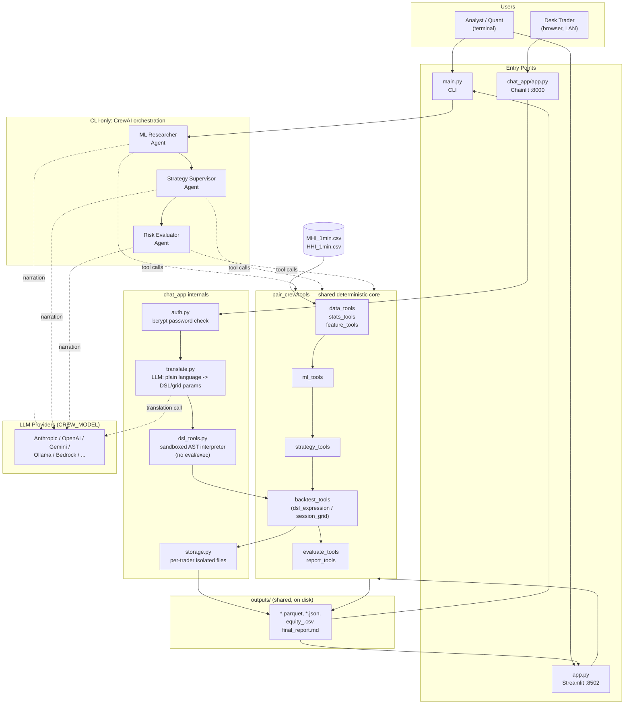

# MHI/HHI Pair Trading — System Architecture & Tech Stack

This document describes *how the system is built* (entry points, tech stack, data flow,
component responsibilities). For *what the current recommended strategy is*, see
`outputs/final_report.md` (generated by the pipeline, not hand-written) — that's a trading
analysis deliverable, not engineering documentation.

**Rendered version:** https://claude.ai/code/artifact/cb41be27-2509-4822-9813-0d7d7365eff5

## 1. Three entry points, one shared core

The same deterministic tool chain (`pair_crew/tools/`) is reused by three different
front ends, so results are always computed by identical, tested code regardless of how
they're triggered:

| Entry point | File | Audience | LLM involved? |
|---|---|---|---|
| CLI | `main.py` | direct pipeline run from the terminal | Yes — 3-agent CrewAI crew narrates/orchestrates the deterministic tools |
| Web dashboard | `app.py` (Streamlit, port 8502) | fast iteration on data/results | No — runs the deterministic tools directly, no API key needed |
| Trader chat | `chat_app/app.py` (Chainlit, port 8000) | a desk of traders, each with their own login | Yes — only for translating plain-language strategy descriptions into a safe DSL; never for computing P&L |

## 2. System Design



**Reading the diagram:** solid arrows are direct function calls / data reads; dashed
arrows are LLM calls (narration for the CLI's agents, translation for the chat app).
Only two things ever call an LLM — the CrewAI agents (CLI path) and `translate.py` (chat
path) — and neither ever computes a trading number itself; every dollar figure anywhere
in the system comes from `backtest_tools.py`, called either by the deterministic pipeline
(CLI/Streamlit) or directly by the chat app once a trader confirms a translated strategy.

## 3. Tech stack

| Layer | Technology |
|---|---|
| Language | Python 3 |
| Multi-agent orchestration | [CrewAI](https://github.com/crewAIInc/crewAI) (`crewai[anthropic]`) — sequential 3-agent process |
| LLM provider | Configurable via `CREW_MODEL` env var — Anthropic, OpenAI, Azure, Bedrock, Gemini, or any `openai_compatible` provider (Ollama, DeepSeek, OpenRouter, etc.); chat app currently configured against Gemini |
| Data / numerics | pandas, numpy, pyarrow (parquet I/O) |
| Stats | statsmodels, scipy (cointegration, ADF, Hurst exponent, half-life) |
| ML | scikit-learn (Logistic Regression, Random Forest, Gradient Boosting), joblib (model persistence) |
| Web dashboard | Streamlit |
| Chat frontend | Chainlit |
| Auth | bcrypt (per-trader password hashing, no plaintext credentials stored) |
| Plotting | matplotlib (Streamlit dashboard equity/report visuals) |
| Config/secrets | python-dotenv (`.env`) |

## 4. `pair_crew/` — the shared core

```
pair_crew/
├── config.py       # single source of truth: contract specs, costs, session times, grid params
├── agents.py        # CrewAI Agent definitions (CLI path only)
├── tasks.py          # CrewAI Task definitions + guardrails (CLI path only)
├── crew.py            # wires agents+tasks into a sequential Crew (CLI path only)
└── tools/
    ├── data_tools.py       # load_clean_align_pair_data
    ├── stats_tools.py       # test_pair_relationship (cointegration/ADF/Hurst/half-life)
    ├── feature_tools.py      # engineer_pair_features
    ├── ml_tools.py             # train_and_compare_models
    ├── strategy_tools.py        # build_candidate_strategies (fixed strategy catalog)
    ├── backtest_tools.py          # run_backtest_for_strategy, backtest_all_strategies
    ├── evaluate_tools.py            # evaluate_strategies (reject/select)
    ├── report_tools.py                # compile_final_report
    ├── tune_tools.py                   # tune_test_split_grid_entry_ticks
    └── dsl_tools.py                      # sandboxed expression DSL (chat app only)
```

Every tool is a plain, deterministic Python function wrapped with `@tool(...)` so CrewAI
agents can call it — but every tool also works standalone (`.func()`), which is exactly
how the Streamlit app and this session's manual pipeline runs invoke them, with zero LLM
involvement. **`config.py` is the single source of truth** for everything that must stay
consistent across all three entry points: hedge ratio (2 MHI : 1 HHI lots), contract
multipliers (HKD 10/pt MHI, HKD 50/pt HHI), commission (HKD 6/6/7.5 per lot per side),
slippage (currently 0 ticks), session anchor times (9:15am/9:30am/1pm HKT), and grid
strategy parameters. Nothing is hardcoded twice.

## 5. Data flow

```
MHI_1min.csv, HHI_1min.csv (repo root, appended to via Streamlit uploader)
        │
        ▼
load_clean_align_pair_data  →  outputs/aligned_data.parquet
        │
        ▼
test_pair_relationship      →  outputs/pair_stats.json
        │
        ▼
engineer_pair_features      →  outputs/features.parquet
        │
        ▼
train_and_compare_models    →  outputs/best_model.joblib, predictions.parquet
        │
        ▼
build_candidate_strategies  →  outputs/strategies.json   ◄── chat app builds its own
        │                                                     strategy specs directly
        ▼                                                     via translate.py, bypassing
backtest_all_strategies     →  outputs/backtest_results.json, equity_<id>.csv
        │
        ▼
evaluate_strategies         →  outputs/evaluation.json
        │
        ▼
compile_final_report        →  outputs/final_report.md
```

All three entry points read/write the same `outputs/` directory, so e.g. running the
Streamlit "Run full pipeline" button and then opening the chat app both see the same
underlying model/data — but the chat app's per-strategy backtests are *ad hoc* (run
on demand per trader request), not part of this fixed staged pipeline.

## 6. CLI path: CrewAI multi-agent workflow (`main.py`)

Three agents run **sequentially** (`Process.sequential`), each restricted to its own
tools and unable to skip steps:

1. **Quantitative ML Researcher** — calls `load_clean_align_pair_data` →
   `test_pair_relationship` → `engineer_pair_features` → `train_and_compare_models`, in
   that fixed order (each tool consumes the previous one's saved output).
2. **Pair Trading Strategy Supervisor** — calls `build_candidate_strategies` then
   `backtest_all_strategies`.
3. **Risk & Strategy Evaluator** — calls `evaluate_strategies` then
   `compile_final_report`.

Each task has a **guardrail** that verifies the tool's expected output file was actually
(re)written during that run (checked via a `run_started_at` timestamp captured before the
crew starts). If an agent answers from "imagination" without really calling its tools —
observed in practice during this session — the guardrail blocks the response and forces a
retry (up to 4 attempts) with an explicit instruction to call the real tools in order.
This is the mechanism that keeps every number in the final report traceable to an actual
computation rather than an LLM guess.

## 7. Backtest engine (`backtest_tools.py`)

Event-driven, bar-by-bar, no-lookahead: signals are evaluated on a bar's close, fills
happen at the *next* bar's open. Dispatches to one of two engines per strategy spec:

- **`engine="dsl_expression"`** — single-position, volatility-scaled sizing, signal
  function is a compiled DSL expression. Used by the four ML/TA strategies and every
  chat-app strategy.
- **`engine="session_grid"`** — session-anchored, multi-lot ladder (fixed lots per rung,
  up to a lot cap, staged stop-loss). Used by the five grid/fade strategies (afternoon,
  full-day and morning variants at both the 9:15am and 9:30am anchors).

Every trade — non-grid entry/exit or grid add/close — pays `config.spread_transaction_cost()`:
commission (real per-lot HKD schedule) plus slippage (currently 0 ticks, configurable),
computed independently per leg via each leg's own contract multiplier.

## 8. Chat frontend (`chat_app/`) — the trader-facing product

```
chat_app/
├── app.py         # Chainlit UI: conversation loop, draft confirmation, backtest trigger
├── auth.py         # @cl.password_auth_callback — bcrypt-checks against CHAT_TRADERS env var
├── config.py         # user_dir(username) — per-trader data isolation
├── storage.py           # save/list strategies + backtest results, scoped per trader
├── translate.py            # LLM plain-language → DSL/grid-params translation + validation
└── user_data/<username>/     # gitignored, one directory per trader
    ├── strategies/*.json      # confirmed strategy specs
    └── results/*.json + *_equity.csv
```

**Security model:** the LLM in `translate.py` never executes code or computes a backtest
number — its only output is a small, typed Pydantic object (`StrategyTranslation`) with
either DSL expression *strings* (entry/exit/stop) or grid parameters (anchor, ticks,
lot count). Expression strings are compiled by `dsl_tools.py`'s hand-written AST
interpreter against a whitelist of ~15 named variables and a fixed operator set —
`eval()`/`exec()` is never called on LLM-authored text. Only after the trader explicitly
confirms the plain-English restatement does `run_backtest_for_strategy` (the exact same
function the CLI/Streamlit pipeline uses) actually compute a result. Each trader's
strategies and results are isolated under `chat_app/user_data/<username>/`, keyed off
`cl.User.identifier` set by the bcrypt-verified login.

**Grid mode:** for multi-lot "ladder" strategies (not expressible as a single boolean DSL
expression), the LLM instead fills structured `grid_*` fields — anchor
(`morning_open` 9:15am / `mid_morning_open` 9:30am / `afternoon_reopen` 1pm), session
scope (full day / morning only / through night), entry/add/take-profit ticks, lot cap,
and a stop-loss in either dollars or ticks. `_validate_grid_translation` enforces all
required fields and rejects contradictory input (e.g. both stop-loss units set) before
`build_strategy_spec` hands it to the same `session_grid` backtest engine the CLI uses.

## 9. Deployment notes (this environment)

All three apps run as background processes on this machine, each bound to `0.0.0.0` so
they're reachable over the LAN, not just localhost:

| App | Port | Launch command |
|---|---|---|
| Chat app (Chainlit) | 8000 | `chainlit run chat_app/app.py --host 0.0.0.0 -h` |
| Streamlit dashboard | 8502 | `streamlit run app.py --server.port 8502 --server.address 0.0.0.0` |
| CLI | — | `python main.py` (one-shot, not a server) |

None of these use `--watch`/auto-reload, so a code change requires killing and
relaunching the process to take effect. Port 8501 is occupied by an unrelated process on
this machine — the Streamlit dashboard intentionally runs on 8502 instead.
